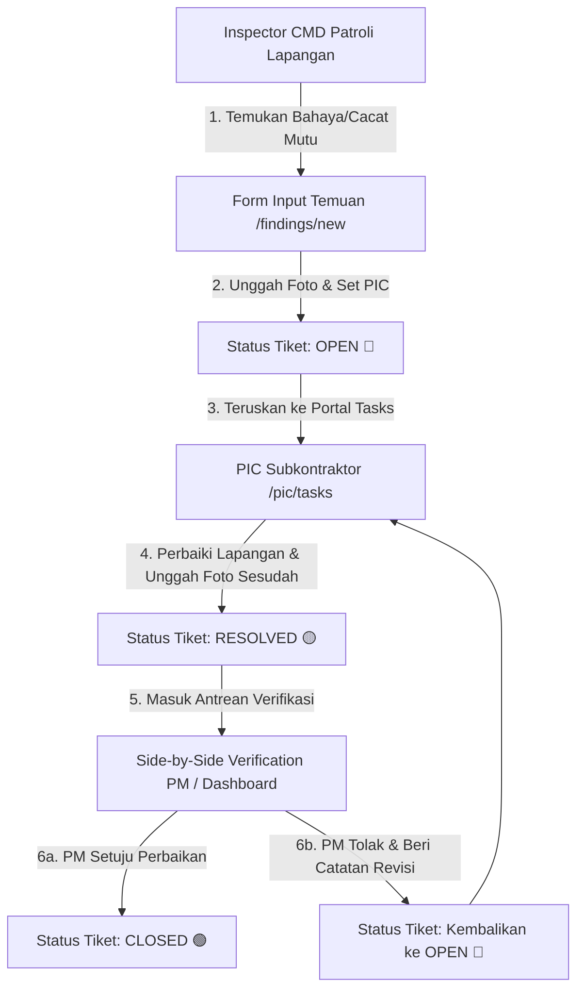
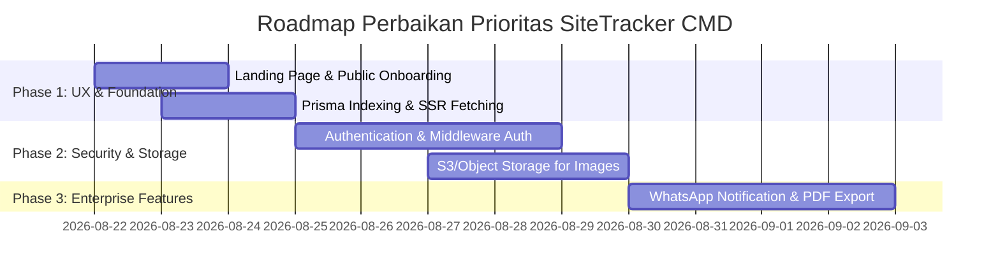

# AUDIT REPORT: SITETRACKER CMD
**Dokumen Audit Independen, Due Diligence Teknologi, Keamanan, UI/UX, & Arsitektur Database**  
*Peran: Independent Tech Auditor & Interim CTO*  
*Tanggal Audit: 21 Agustus 2026*  
*Aplikasi: SiteTracker CMD (Construction Site Patrol & Finding Tracker)*  

---

## 1. Ringkasan Pemahaman Project (Executive Summary)

**SiteTracker CMD** adalah platform digital berbasis web yang dirancang khusus untuk memodelkan, mencatat, memantau, dan memverifikasi **temuan patroli lapangan (*site walk-through findings*)** di proyek konstruksi fisik. Aplikasi ini mengatasi bottleneck utama pada operasional lapangan: **lambatnya respon terhadap bahaya K3 (Safety), penumpukan cacat mutu konstruksi (Quality), sisa sampah proyek (Kebersihan 5R), keterlambatan jadwal (Schedule), serta kerusakan material logistik.**

### Target Pengguna & Peran Sistem:
1. **CMD / Field Inspector (Pelapor):** Petugas K3 & Quality Control yang melakukan patroli fisik di lapangan, mengambil foto bukti bahaya, dan menerbitkan tiket temuan baru.
2. **PIC Lapangan / Subkontraktor (Eksekutor):** Penanggung jawab area kerja spesifik yang wajib menindaklanjuti perbaikan fisik dan mengunggah foto bukti perbaikan.
3. **Project Manager / PM (Verifikator):** Pengambil keputusan utama yang memverifikasi hasil perbaikan secara *Side-by-Side* (Sebelum vs. Sesudah), lalu menyetujui (*Approve/Closed*) atau menolak (*Reject/Re-work*).
4. **Board of Directors / BOD (Executive Overview):** Manajemen puncak yang memantau tingkat kepatuhan K3, kecepatan resolusi masalah, dan kesehatan fisik seluruh portofolio proyek.

---

## 2. Daftar Fitur yang Sudah Tersedia

| No | Nama Fitur / Modul | Rute URL | Status Implementasi | Deskripsi Fungsi |
|---|---|---|---|---|
| 1 | **Dashboard Utama** | `/` | ✅ Functional | Dashboard interaktif berisi KPI Ringkasan Status Tiket (Open, Resolved, Closed, Total), Antrean Verifikasi PM, serta Filter Proyek, Kategori, Status & Search Bar. |
| 2 | **Input Temuan Baru** | `/findings/new` | ✅ Functional | Form pembuatan tiket temuan dengan auto-filter PIC berdasarkan proyek, 5 kategori temuan, deskripsi, lokasi spesifik, koordinat GPS, dan uploader foto. |
| 3 | **Portal Tugas PIC** | `/pic/tasks` | ✅ Functional | Halaman khusus PIC untuk melihat daftar tiket `OPEN` yang ditugaskan kepadanya dan mengunggah respon/foto bukti perbaikan. |
| 4 | **Detail Tiket & Histori** | `/findings/[id]` | ✅ Functional | Halaman detail tiket komprehensif dengan tampilan lokasi GPS (link Google Maps), identitas pelapor/PIC, catatan penolakan PM, dan form aksi perbaikan. |
| 5 | **Modal Verification Side-by-Side** | Modal Pop-up | ✅ Excellent Feature | Pop-up modal interaktif yang membandingkan foto **Sebelum (Temuan Awal)** vs **Sesudah (Hasil Perbaikan)** secara *apples-to-apples* untuk kemudahan validasi PM. |
| 6 | **Photo Uploader & Compression** | Component | ✅ Client-Optimized | Menggunakan HTML5 Canvas client-side compression (max 1200px, quality 0.75) sebelum gambar diunggah/disimpan. |
| 7 | **Integrasi GPS Geolocation** | Component | ✅ Functional | Tombol Geolocation browser untuk mengambil latitude & longitude serta menghasilkan link Google Maps otomatis. |
| 8 | **Direct Role Switcher Widget** | Component | ⚠️ Dev/Demo Feature | Widget simulasi penggantian peran (*Role Simulator*) via `RoleContext` dan `localStorage`. |
| 9 | **Daftar Proyek & Tim** | `/projects` | ✅ Functional | Katalog proyek aktif dengan statistik breakdown tiket dan daftar personil/PIC terdaftar. |
| 10| **Resilient Database Fallback** | Server Action | ✅ Architecture | Server Actions memiliki fallback otomatis ke data in-memory jika koneksi database Neon PostgreSQL terputus/gagal. |

---

## 3. User Flow yang Teridentifikasi (Business Lifecycle)



---

## 4. Kelebihan dan Kekurangan Aplikasi

### Kelebihan (Strengths):
1. **Sangat Terfokus pada Problem Real Konstruksi:** Siklus hidup tiket 3-tahap (`OPEN` $\rightarrow$ `RESOLVED` $\rightarrow$ `CLOSED` dengan loop perbaikan ulang) sangat sesuai dengan standar ISO 45001 (K3) dan ISO 9001 (Mutu).
2. **Side-by-Side Verification visual:** Memungkinkan PM mengambil keputusan secara cepat dan objektif tanpa perlu pergi ke lokasi fisik untuk hal-hal minor.
3. **Responsive Mobile-First UI:** Navigasi bawah (*bottom bar*) membuat aplikasi nyaman digunakan dengan satu tangan di area proyek.
4. **Client-Side Image Compression:** Mengompres foto otomatis hingga 70-80% lebih kecil sebelum upload, menghemat kuota seluler inspector.
5. **Fallback Architecture:** Aplikasi memiliki mekanisme fallback ke *in-memory mock data* saat database Neon PostgreSQL belum terhubung, sehingga demo tidak pernah *crash*.

### Kekurangan (Weaknesses):
1. **Tidak Ada Landing Page Utama:** Pengunjung pertama kali yang membuka URL root langsung dihadapkan pada Dashboard operasional tanpa pengenalan produk, keunggulan, maupun petunjuk penggunaan.
2. **Tidak Ada Autentikasi Server (Zero Auth Security):** Ganti role hanya berbasis *state* React client-side. Tidak ada mekanisme login, password, JWT, atau middleware guard di Server Actions.
3. **Penyimpanan Foto Base64 di Database:** Foto disimpan dalam bentuk string Data URL Base64 langsung di kolom `@db.Text` PostgreSQL. Hal ini membuat ukuran database membengkak (*database bloat*) dan *query* menjadi lambat.
4. **Variabel Memory State yang Ephemeral di Serverless:** Fallback memory array (`inMemoryFindings`) pada serverless Next.js akan ter-reset setiap kali instance lambda mati/restart, menyebabkan data hilang jika DB mati.
5. **Belum Ada Fitur Ekspor & Notifikasi:** Belum ada ekspor laporan PDF/Excel untuk rapat mingguan proyek, serta belum ada notifikasi WhatsApp/Email untuk PIC.

---

## 5. Temuan Bug, Technical Debt, dan Potensi Masalah

1. **Race Condition pada Generasi Ticket Code:**
   * Kode tiket dibuat via `generateTicketCode(existingCount)`. Jika 2 inspector mengirim temuan bersamaan, keduanya bisa mendapatkan kode tiket yang sama (`CMD-2026-005`), memicu *Constraint Violation Error* pada database.
2. **Tidak Ada Pagination pada Query Data (`getFindings`):**
   * Server action `getFindings()` mengambil *seluruh* baris data tanpa limit (`take`/`skip`). Ketika data mencapai 5.000+ tiket, pengunduhan JSON akan berukuran belasan MB dan melambatkan browser secara drastis.
3. **Layout Shift & Client-Side Fetching (`"use client"` everywhere):**
   * Semua halaman utama (`page.tsx`, `findings/page.tsx`, `projects/page.tsx`) menggunakan `"use client"` dan melakukan *fetch* di `useEffect`. Ini menyebabkan *Cumulative Layout Shift* (CLS) dan membuang potensi performa Server-Side Rendering (SSR) Next.js 14.
4. **Tipe Data File Upload:**
   * Penggunaan string Base64 langsung di payload Server Action menyebabkan ukuran request HTTP melambung hingga 1-3MB per submission, melebihi rekomendasi batas Server Action Next.js (1MB default).

---

## 6. Audit UI/UX

* **Skor UI/UX: 85/100**
* **Evaluasi Desain & Ergonomi:**
  * **Tipografi & Kontras:** Penggunaan font sans-serif modern dengan kontras tinggi (Slate-900 vs Yellow-500) memberikan kesan industrial yang sangat tegas dan profesional.
  * **Touch Target & Ukuran Tombol:** Seluruh elemen interaktif memiliki `min-height: 44px - 48px`, mematuhi panduan aksesibilitas Google & Apple untuk penggunaan dengan jari/sarung tangan kerja.
  * **Visual Feedback:** Status tiket diindikasikan dengan warna dan ikon yang jelas: 🔴 OPEN (Red), 🟡 RESOLVED (Amber), 🟢 CLOSED (Emerald).
* **Catatan UI/UX Improvement:**
  * **Need Public Onboarding / Landing Page:** User baru/klien luar tidak paham konteks aplikasi saat pertama kali masuk URL.
  * **Form Input Terlalu Panjang:** Halaman `/findings/new` berpotensi membuat lelah inspector jika digunakan puluhan kali sehari di bawah terik matahari. Perlu dibuat wizard step atau pemendekan form.

---

## 7. Audit Performa

* **Skor Performa: 72/100**
* **Metrik & Temuan Performa:**
  * **Client-Side Compression:** Berhasil menurunkan ukuran gambar dari 5MB menjadi ~150KB sebelum transmisi data. (Sangat Baik)
  * **Network Waterfall Overhead:** Ketergantungan halaman utama pada client-side `useEffect` menambah *waterfall request* (Load HTML $\rightarrow$ Run JS $\rightarrow$ Call Server Action $\rightarrow$ Render UI).
  * **Bundle Size:** Penggunaan `lucide-react` diimpor dengan baik, namun komponen pihak ketiga untuk visualisasi chart belum ada.

---

## 8. Audit Keamanan

* **Skor Keamanan: 45/100 (KRITIS)**
* **Vulnerabilitas Utama:**
  1. **Zero Authorization Check:** Siapa pun dapat memanggil Server Action `validateFinding({ action: "APPROVE" })` atau `resolveFinding()` secara langsung via terminal/POST request tanpa token sesi.
  2. **Impersonation Vulnerability:** Pengguna dapat mengganti ID reporter/PIC hanya dengan mengubah data di browser console.
  3. **No Input Sanitization / Rate Limiting:** Form deskripsi temuan belum di-sanitize dari skrip jahat (XSS) dan belum ada pembatasan *rate limiting* pada pencatatan tiket.

---

## 9. Audit Database dan Arsitektur

* **Skor Database & Arsitektur: 65/100**
* **Struktur Prisma Schema (`prisma/schema.prisma`):**
  * Model `Project`, `User`, dan `Finding` memiliki relasi `1:N` yang tepat.
  * Penggunaan Enum (`Role`, `Category`, `FindingStatus`) sangat rapi dan mencegah korupsi data string.
* **Kelemahan Arsitektur DB:**
  * **Absensi Indexing:** Tidak ada index `@index([projectId])`, `@index([status])`, `@index([category])` pada tabel `findings`. Pencarian dan filtering pada tabel besar akan sangat lambat.
  * **Base64 Storage Anti-Pattern:** Kolom `photoFindingUrl` tipe `@db.Text` menyimpan Base64 image string. Ini bertentangan dengan *best practice* database relasional.

---

## 10. Audit Scalability

* **Skor Scalability: 60/100**
* **Analisis Kemampuan Skala:**
  * **Storage Scaling Limit:** Menyimpan foto dalam PostgreSQL akan menghabiskan storage Neon DB dalam hitungan minggu jika ada 100+ temuan foto per hari.
  * **Concurrency Limitation:** Penentuan nomor tiket berbasis `count()` rentan terhadap tabrakan data saat digunakan oleh puluhan tim patroli secara bersamaan di berbagai lokasi proyek.

---

## 11. Missing Feature yang Sebaiknya Ditambahkan

1. **Landing Page Publik (Simple & Informatif):** Halaman depan yang menjelaskan solusi SiteTracker CMD bagi pemilik proyek/kontraktor.
2. **SLA & Countdown Deadline per Tiket:** Penanda batas waktu (misal: Temuan K3 harus selesai dalam 24 jam).
3. **Ekspor Laporan PDF Patroli:** Fitur *One-Click Export* rekapitulasi temuan mingguan berformat PDF profesional.
4. **Integrasi Notifikasi WhatsApp (Fonnte/Twilio):** Notifikasi instan ke nomor WhatsApp PIC ketika ada tiket baru ditugaskan.
5. **Autentikasi & Authorization (NextAuth / Clerk / Neon Auth):** Login multi-tenant yang aman.

---

## 12. Top 10 Masalah Paling Kritis

| No | Masalah Kritis | Dampak Bisnis / Teknis | Risk Level |
| --- | --- | --- | --- |
| 1 | **Tidak ada Sistem Autentikasi (Zero Server Auth)** | Pengguna tidak sah bisa menyetujui/menolak tiket perbaikan | 🔴 CRITICAL |
| 2 | **Base64 Photo Storage di Database** | Database membengkak cepat, query lambat, biaya Neon membumbung | 🔴 CRITICAL |
| 3 | **Race Condition Kode Tiket (`generateTicketCode`)** | Tiket gagal disimpan saat dipanggil bersamaan oleh inspector | 🟠 HIGH |
| 4 | **Absensi Index pada Database PostgreSQL** | Query dashboard lambat saat tiket mencapai ribuan baris | 🟠 HIGH |
| 5 | **Tidak Ada Landing Page Publik** | Pengunjung luar tidak memahami aplikasi & kesulitan onboarding | 🟠 HIGH |
| 6 | **State In-Memory Ephemeral di Serverless** | Data simulasi hilang/acak di Next.js serverless instance | 🟠 HIGH |
| 7 | **Absensi Pagination (`take`/`skip`)** | Browser crash karena memuat seluruh data tiket sekaligus | 🟡 MEDIUM |
| 8 | **Penggunaan `"use client"` Berlebihan** | Kehilangan keuntungan performa SSR & SEO Next.js | 🟡 MEDIUM |
| 9 | **Tidak Ada Notifikasi Real-time (WA/Email)** | PIC terlambat mengetahui ada temuan K3 bahaya tinggi | 🟡 MEDIUM |
| 10 | **Absensi SLA / Tracking Due Date** | Tidak ada akuntabilitas keterlambatan perbaikan oleh PIC | 🟡 MEDIUM |

---

## 13. Top 10 Quick Wins (Effort Rendah, Impact Tinggi)

1. **Tambahkan Landing Page Publik Modern & Simpel (`/landing` atau Home)** untuk memperkenalkan aplikasi ke pengguna baru.
2. **Tambahkan Index Prisma Schema** pada `projectId`, `picId`, `status`, dan `category`.
3. **Tambahkan Fitur Export PDF/Print View** sederhana untuk laporan temuan.
4. **Tambahkan Countdown SLA Badge** pada tiket temuan K3 (misal: *Due in 24h*).
5. **Pindahkan Data Fetching Dashboard ke Server Component (SSR)** untuk mempercepat *Initial Page Load*.
6. **Beri Filter Quick-Tab** pada Dashboard (*Contoh: Tab "Temuan K3 Saya", "Perlu Verifikasi"*).
7. **Beri Indikator Status Koneksi DB vs In-Memory** di UI agar user tahu mode mana yang sedang berjalan.
8. **Tambahkan Fitur Filter Berdasarkan Rentang Tanggal (Date Range Filter).**
9. **Optimasi Meta Tag SEO & Title Tags** di setiap rute halaman Next.js.
10. **Tambahkan Toast Notification** setelah form berhasil dikirim.

---

## 14. Penilaian Skor Aplikasi (Scorecard 0-100)

```
Product Concept & Business Value : 82 / 100
UI / UX & User Experience        : 85 / 100
Code Quality & Clean Architecture: 70 / 100
Database Design & Integrity      : 65 / 100
Performance & Optimization       : 72 / 100
Security & Access Control        : 45 / 100 (Kritis)
Launch Readiness (Kesiapan Rilis): 55 / 100
-------------------------------------------------------
OVERALL HEALTH SCORE             : 67.6 / 100 (B-)
```

---

## 15. Prioritas Perbaikan Berdasarkan Impact Bisnis & User



---

## 16. Rekomendasi Fitur Baru Segera: Simple Landing Page

Untuk melengkapi aplikasi dan memberikan kesan profesional saat diakses publik, **Landing Page** yang simpel dan informatif harus segera ditambahkan dengan elemen:
1. **Hero Header:** Penjelasan ringkas nilai tambah SiteTracker CMD + Tombol CTA ke Dashboard Demo.
2. **Core Value Cards:** 4 Pilar Utama (Keselamatan K3, Kualitas Mutu, Kebersihan 5R, Ketepatan Jadwal).
3. **Workflow Visual:** 3 Langkah Mudah (Catat Temuan $\rightarrow$ Perbaiki Lapangan $\rightarrow$ Verifikasi Side-by-Side).
4. **Peran Pengguna (Role Value Proposition):** Keuntungan khusus bagi Inspector, Subkontraktor, PM, dan BOD.
5. **Interactive Demo CTA:** Banner pengajak mencoba fitur tanpa hambatan.
